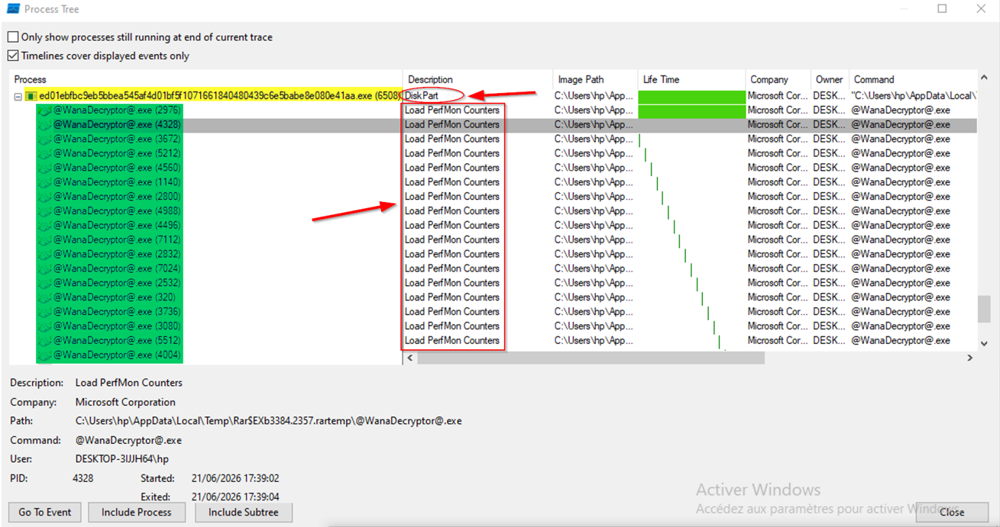
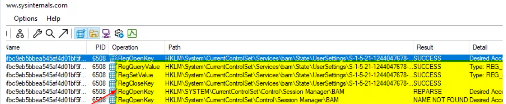
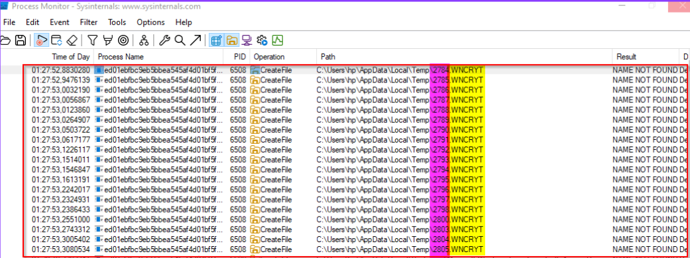
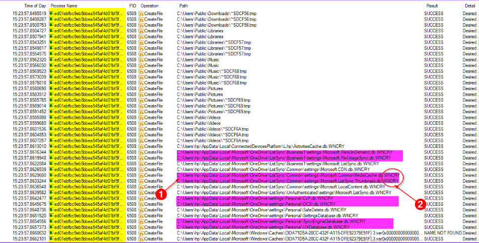
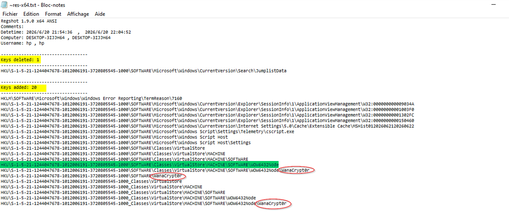
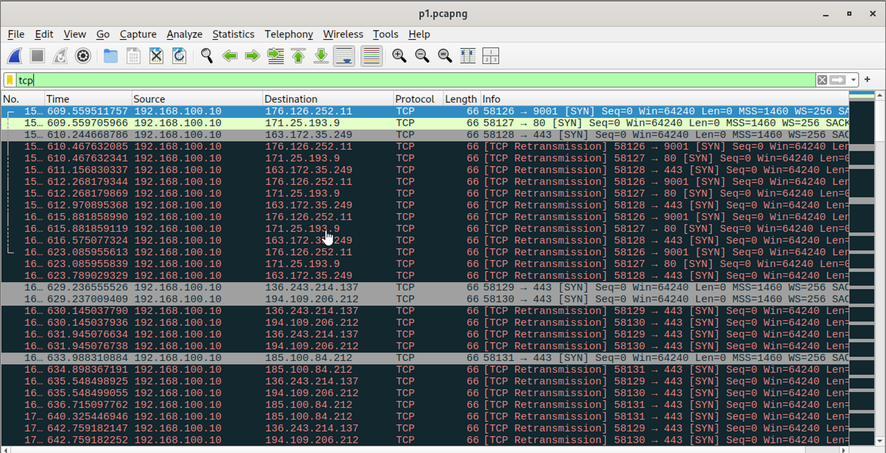

  
  
  
  

# 🧬 WannaCry Ransomware: In-Depth Dynamic Analysis

> **A comprehensive behavioral analysis of the WannaCry (WanaCrypt0r 2.0) ransomware, executed in a controlled, isolated sandbox environment.**

This repository contains the full forensic report and evidence artifacts from a dynamic malware analysis engagement. The objective was to map the complete infection chain—from initial delivery to the final ransom note—using industry-standard tools, cross-validated against a complementary static analysis performed by a teammate.

> 📄 **Note:** the full detailed report is written in French (linked below). This README provides a complete summary in English.

---

## 🎯 Executive Summary

WannaCry is a notorious ransomware worm that caused a global cyberattack in May 2017. This analysis successfully observed and documented its core behaviors:

- **Initial Access**: Delivery via a self-extracting RAR archive dropped into the user's `%TEMP%` directory.
- **Evasion**: The main process renamed itself to an MD5 hash and falsified its internal description to "DiskPart" (parent) and "Load PerfMon Counters" (children), spoofing the "Microsoft Corporation" company field.
- **Execution**: Launched **18+ parallel child processes** to encrypt files rapidly via multi-process processing, each with a lifespan of only ~2 seconds.
- **Anti-Forensics**: Directly read and overwrote the BAM (Background Activity Moderator) registry key to obscure its execution timestamp.
- **Impact**: Encrypted thousands of files indiscriminately — including internal application databases (OneDrive sync caches) alongside user documents — via a two-stage pipeline (`.WNCRYT` → `.WNCRY`), then replaced the desktop wallpaper with the `@WanaDecryptor@.bmp` ransom note.
- **C2 Communication**: Attempted anonymous communication with its Command & Control infrastructure via the **Tor network** (TCP ports 9001, 443, 80), blocked by the isolated environment.
- **Kill-Switch**: Confirmed **absent/non-functional** in this sample — validated through both dynamic analysis (no DNS query observed despite a fully responsive simulated network) and static analysis (domain missing from disassembly, present only in a different WannaCry variant).
- **Named Evidence**: Registry comparison (Regshot) revealed a `WanaCrypt0r` key — direct confirmation of the malware's real identity beyond its MD5-hashed filename.

---

## 🖥️ Lab Environment & Toolset

The analysis was performed using an isolated host-only network to prevent accidental internet egress.

| Component | Role | IP Address | Tools Used |
| :--- | :--- | :--- | :--- |
| **Windows 10 (Victim)** | Target machine executing the malware | `192.168.100.10` | ProcMon, Regshot, Process Explorer |
| **Windows 7 (Secondary host)** | Lateral movement / SMB target | `192.168.100.11` | — |
| **REMnux (Gateway/Analyst)** | Simulated internet services & network capture | `192.168.100.1` | INetSim (DNS + HTTP), Wireshark, tcpdump |

**Methodology**: Live behavior was captured in real-time using ProcMon and Wireshark, while Regshot provided a differential analysis of registry and filesystem changes (Before vs. After infection). INetSim was configured as both a DNS and HTTP server to recreate the exact conditions required to trigger a functional kill-switch — a critical step in confirming its absence in this sample.

---

## 🚨 Key Indicators of Compromise (IOCs)

### 🖥️ Registry Modifications
| Path / Key | Action | Severity | Interpretation |
| :--- | :--- | :--- | :--- |
| `HKCU\...\BackgroundHistoryPath0` | Value changed to `@WanaDecryptor@.bmp` | **CRITICAL** | Ransom note wallpaper applied; marks the end of the encryption cycle. |
| `HKLM\...\bam\State\UserSettings` | `RegQueryValue` then `RegSetValue` (REG_BINARY) | **HIGH** | Reads the existing value before overwriting it — direct anti-forensic manipulation of BAM. |
| `SOFTWARE\WanaCrypt0r` / `...\VirtualStore\...\WanaCrypt0r` | Key created | **CRITICAL** | Named evidence of the malware's real identity, found via Regshot differential comparison. |
| `HKCU\...\UserAssist` | Counters (ROT13 encoded) | **INFO** | Confirms execution of analysis tools (ProcExp, Regshot); native Windows behavior, not malware-related. |

### 📂 Filesystem Artifacts
| Path / Indicator | Action | Severity | Interpretation |
| :--- | :--- | :--- | :--- |
| `%TEMP%\Rar$...\@WanaDecryptor@.exe` | Created | **CRITICAL** | Self-extracting RAR delivery vector. |
| `*.WNCRYT` → `*.WNCRY` | Created / Renamed | **CRITICAL** | Two-stage encryption pipeline; sequential numbered temp files confirm an industrialized batch process. |
| `C:\Users\hp\Desktop\@WanaDecryptor@.bmp` | Created | **CRITICAL** | Ransom note image dropped on the Desktop. |
| `~SDxxxx.tmp` | Created | **HIGH** | Temporary buffer files used during encryption processing. |
| `b.wnry` / `00000000.res` | Extracted | **HIGH** | Embedded wallpaper bitmap and multilingual resources (~28 languages). |

### 🌐 Network Signatures
| Indicator | Observation | Severity | Interpretation |
| :--- | :--- | :--- | :--- |
| **Tor C2 Traffic** | TCP SYN retransmissions to multiple hardcoded IPs (ports 9001, 443, 80), exponential backoff observed. | **CRITICAL** | Hardcoded Tor node list attempts to establish an anonymous C2 channel; no DNS resolution precedes these connections. |
| **Kill-Switch** | DNS query for `iuqerfsodp9ifj...com` | **CONFIRMED ABSENT** | INetSim configured as DNS+HTTP server to satisfy both kill-switch conditions; encryption still completed — confirmed by static analysis as a variant without this domain. |
| **SMB / EternalBlue** | Port 445 traffic toward secondary Windows 7 host. | **INCONCLUSIVE** | Connection attempts observed; target host's MS17-010 patch status affects exploitation success — documented as a valid negative/partial result rather than a confirmed propagation. |

---

## 🗺️ MITRE ATT&CK Framework Mapping

| Tactic | Technique (ID) | Observation |
| :--- | :--- | :--- |
| **Execution** | T1204 - User Execution | User manually extracted the self-extracting RAR archive. |
| **Execution** | T1106 - Native API | Spawned 18+ child processes for parallel encryption. |
| **Defense Evasion** | T1036 - Masquerading | Renamed file to MD5 hash; description set to "DiskPart" / "Load PerfMon Counters"; spoofed "Microsoft Corporation" attribute. |
| **Defense Evasion** | T1070 - Indicator Removal | Read and overwrote the BAM registry key to obscure execution timestamps. |
| **Discovery** | T1083 - File & Directory Discovery | Recursively enumerated all user and system directories (OneDrive, Public, WER) with no targeting logic. |
| **C2** | T1090.003 - Multi-hop Proxy | Attempted communication via hardcoded Tor relay IPs. |
| **C2** | T1571 - Non-Standard Port | Used Tor ORPort (9001) and ports 443/80 to blend in. |
| **Impact** | T1486 - Data Encrypted for Impact | Encrypted files indiscriminately and renamed them with the `.WNCRY` extension. |
| **Impact** | T1491 - Defacement (Internal) | Replaced the desktop wallpaper with the ransom note image. |

---

## 🖼️ Visual Evidence & Artifacts

**1. Process Tree — Masquerading & Parallel Encryption**
The main process (PID 6508) disguised as "DiskPart"; 18+ child instances of `@WanaDecryptor@.exe` masquerading as "Load PerfMon Counters", each with a ~2-second lifespan.

**2. Anti-Forensic BAM Manipulation**
Full sequence: RegOpenKey (All Access) → RegQueryValue → RegSetValue → RegCloseKey on the BAM registry key.

**3. Encryption Pipeline (.WNCRYT → .WNCRY)**
Sequentially numbered temporary files confirming a batch-processed encryption queue.

**4. Non-Selective Encryption**
Transition from probing empty public folders to encrypting real OneDrive internal databases.

**5. Named Malware Evidence (Regshot)**
`WanaCrypt0r` registry key confirmed via differential comparison.

**6. Tor C2 Traffic (Wireshark)**
SYN packets attempting to reach hardcoded Tor nodes (port 9001) with no response, plus the network simulation setup used to test the kill-switch.

---

## ⚠️ Analysis Limitations & Open Points

The following elements remain open for further investigation:

- **csrss.exe Interaction**: PID 716 was observed accessing the Windows Application Compatibility database (`sysmain.sdb`) alongside the malicious binary — consistent with normal OS behavior for any launched executable. Regshot confirmed its expected path (`System32`) and execution context (SYSTEM account), though formal digital signature verification is still pending.
- **SMB/EternalBlue Propagation**: A secondary Windows 7 host was added to the network; connection attempts on port 445 were observed, but successful exploitation depends on the target's MS17-010 patch level — full confirmation pending.
- **Persistence Mechanism**: No `Run`/`RunOnce` registry key or new service was confirmed in this specific run.
- **WannaCry Mutex**: Creation of the characteristic mutex (`MsWinZonesCacheCounterMutexA`) was not yet confirmed in captured traces.

---

## 📄 Full Report

For the complete technical breakdown, including the detailed chronological infection timeline and full ProcMon/Regshot logs, refer to the attached document (French):

- **[Download the Full Analysis Report (DOCX)](docs/Rapport_Final_WannaCry_Analyse_Dynamique.docx)**

---

## 🔒 Recommendations

Based on the analysis, the following defensive measures are recommended:

1. **Deploy EDR (Endpoint Detection & Response)**: Focus on behavioral detections for mass-file encryption (high I/O write rates) rather than static filenames or internal metadata, both easily spoofed.
2. **Patch Management**: Ensure MS17-010 (EternalBlue) is applied to all legacy Windows systems. Consider disabling SMBv1 entirely.
3. **Network Controls**: Monitor egress traffic for Tor-specific ports (9001, 9030) and known Tor relay IP ranges.
4. **BAM Monitoring**: Flag unusual write access to the BAM registry key as a potential anti-forensic indicator.
5. **Backup Strategy**: Maintain offline, immutable backups to ensure recoverability in the event of a successful ransomware encryption.
6. **User Awareness**: Train users to recognize and avoid executing unsolicited self-extracting archives received via email.

---

## 👩‍💻 Author

**Ouchahed Salma**
*Cybersecurity Analyst / Reverse Engineering Enthusiast*
[
[

Static analysis performed in collaboration with a teammate as part of a joint malware analysis project.

---

## 📜 Disclaimer

This project was conducted strictly for **educational and defensive research purposes** in a controlled, air-gapped laboratory environment. The author does not condone the use of malware for any illegal or malicious activities. The sample was obtained from a public security research repository and handled in full compliance with best-practice isolation protocols.
